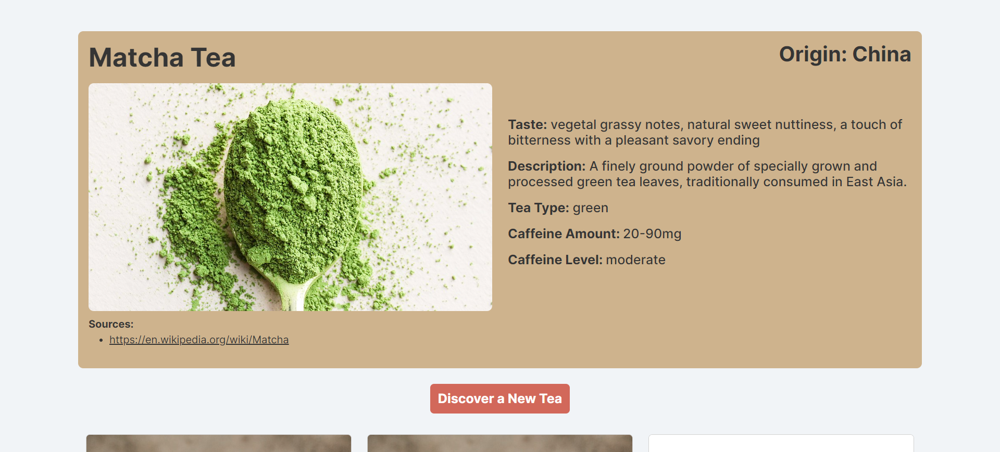

# Tea Discovery App

A web app that allows users to discover and learn more about different types of tea. [Tea json file](/public/data/teas.json) inspired by [Boonaki's Tea API](https://github.com/boonaki/boonakis-tea-api).



## Features

- Displays details of a random tea
- Has a button that allows users to get a new random tea
- Lists out all tea options

## Built With

[![React.js]][React-url] [![Vite]][Vite-url] [![Typscript][Typscript]][Typscript-url] [![Tailwindcss][tailwindcss]][tailwindcss-url] [![TanstackQuery]][TanstackQuery-url] [![Wouter]][Wouter-url]

<!-- GETTING STARTED -->

## Getting Started

To get a local copy up and running follow these simple example steps.

### Prerequisites

This is an example of how to list things you need to use the software and how to install them.

- pnpm
  ```sh
  npm install pnpm@latest -g
  ```

### Installation

1. Clone the repo
   ```sh
   git clone https://github.com/JMixson/tea-discovery.git
   ```
2. Install PNPM packages
   ```sh
   pnpm install
   ```

### Usage

To start the application, run:

```sh
pnpm run dev
```

<!-- MARKDOWN LINKS & IMAGES -->

[React.js]: https://img.shields.io/badge/React-20232A?style=for-the-badge&logo=react&logoColor=61DAFB
[React-url]: https://reactjs.org/
[Vite]: https://img.shields.io/badge/Vite-20232A?style=for-the-badge&logo=vite
[Vite-url]: https://vitejs.dev/
[Typscript]: https://img.shields.io/badge/Typescript-20232A?style=for-the-badge&logo=typescript&logoColor=3178c6
[Typscript-url]: https://www.typescriptlang.org
[Tailwindcss]: https://img.shields.io/badge/Tailwindcss-20232A?style=for-the-badge&logo=tailwindcss&logoColor=20c4ff
[Tailwindcss-url]: https://tailwindcss.com
[TanstackQuery]: https://img.shields.io/badge/-TanstackQuery-20232A?style=for-the-badge&logo=reactquery&logoColor=fb2c36
[TanstackQuery-url]: https://tanstack.com/query/latest
[Wouter]: https://img.shields.io/badge/-Wouter-20232A?style=for-the-badge
[Wouter-url]: https://github.com/molefrog/wouter
