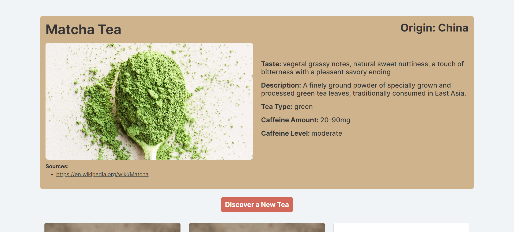

# Tea Discovery App

A web app that allows users to discover and learn more about different types of tea.



## Features

- Displays details of a random tea
- Has a button that allows users to get a new random tea
- Lists out all tea options

## Built With

[![React][React.js]][React-url]
[![Vite][Vite]][Vite-url]
[![Bootstrap][Bootstrap.com]][Bootstrap-url]

<!-- GETTING STARTED -->

## Getting Started

To get a local copy up and running follow these simple example steps.

### Prerequisites

This is an example of how to list things you need to use the software and how to install them.

- npm
  ```sh
  npm install npm@latest -g
  ```

### Installation

1. Clone the repo
   ```sh
   git clone https://github.com/JMixson/tea-discovery.git
   ```
2. Install NPM packages
   ```sh
   npm install
   ```

### Usage

To start the application, run:

```sh
npm run dev
```

## Extra Image Credits

- Nathan Dumlao - [Placeholder Tea Photo](https://unsplash.com/photos/flat-lay-photography-of-eight-coffee-latte-in-mugs-on-round-table-pMW4jzELQCw)

<!-- MARKDOWN LINKS & IMAGES -->

[React.js]: https://img.shields.io/badge/React-20232A?style=for-the-badge&logo=react&logoColor=61DAFB
[React-url]: https://reactjs.org/
[Vite]: https://img.shields.io/badge/Vite-20232A?style=for-the-badge&logo=vite
[Vite-url]: https://vitejs.dev/
[Bootstrap.com]: https://img.shields.io/badge/Bootstrap-563D7C?style=for-the-badge&logo=bootstrap&logoColor=white
[Bootstrap-url]: https://getbootstrap.com
